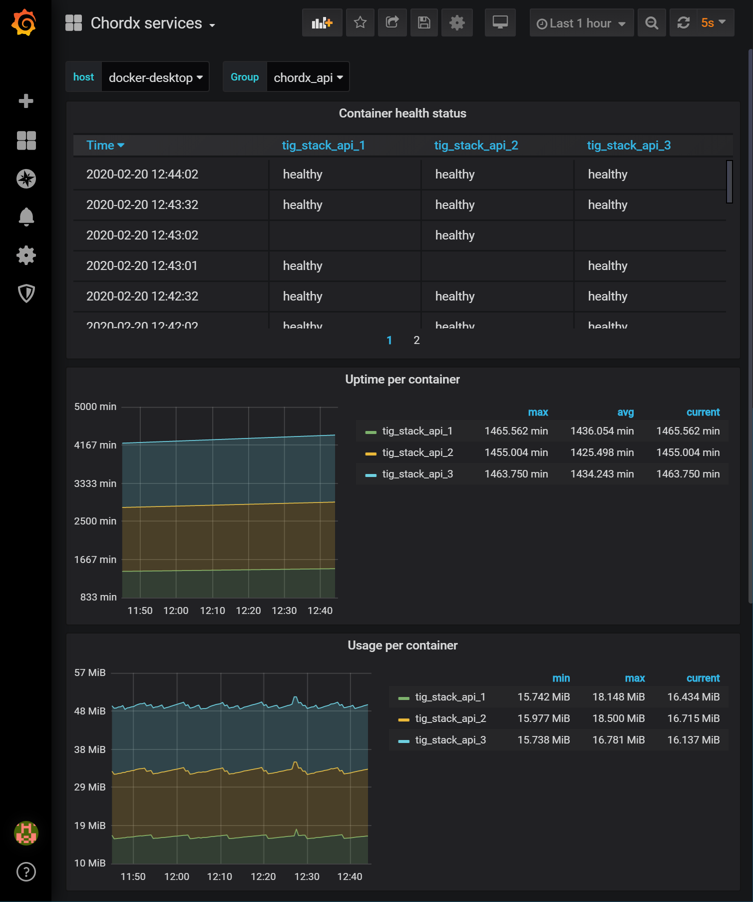
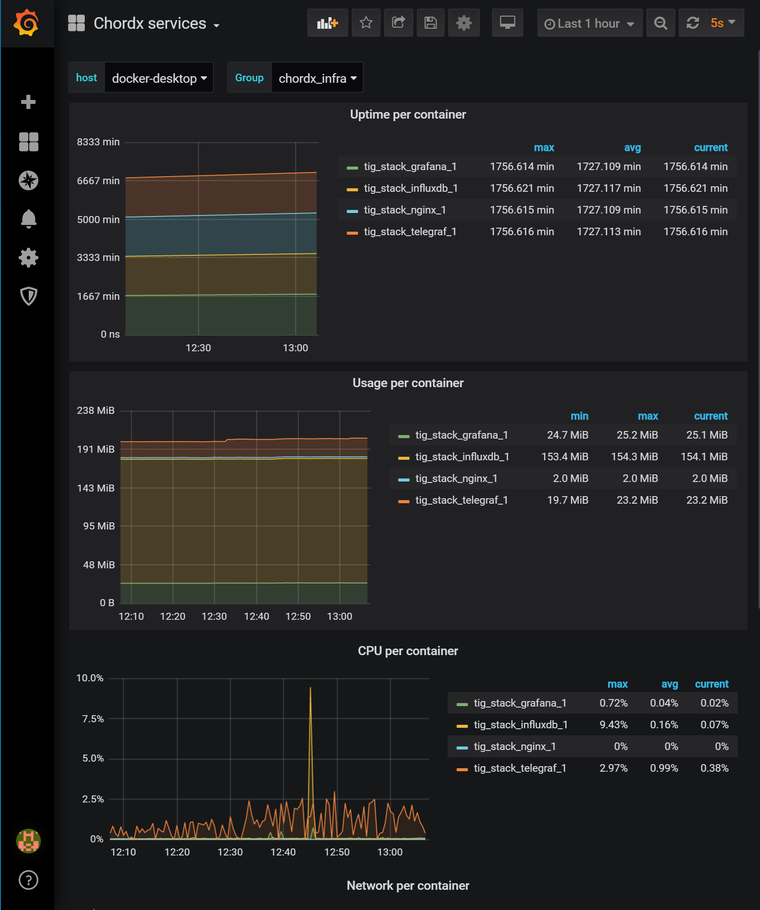

# __Chordx TIG + Custom API__

A simple dockerized TIG (Telegraf, InfluxDB and Grafana) and Node/Express with NGINX load balancing example using docker-compose for managing the containers.

## __Running the services__

```bash
docker-compose up -d
```

__To run multiple instances of the `Custom API`:__

```bash
docker-compose up -d --scale api=3
```

__To follow the logs live:__

```bash
docker-compose logs --follow
```

__Stopping the services:__

```bash
docker-compose down
```

### __Running on Windows__

To run this on windows you have to

1. Expose the docker daemon on `tcp://localhost:2375` without TLS (see [docker docs](https://docs.docker.com/docker-for-windows/#general)).
2. Configure the endpoint used by the `Docker Input Plugin` under `telegraf/telegraf.conf`.

## __Information__

The containers are tagged with a custom label (`org.label-schema.group`) which is used to group the services into different categories within the Grafana dashboard.

| Label        | Description                                              |
|--------------|----------------------------------------------------------|
| chordx_api   | Used for grouping the Custom APIs together (or future APIs) |
| chordx_infra | Used for grouping the infrastructure components together (InfluxDB, Nginx, etc.) |

### __Resiliency__

The Custom API is equipped with [health checks](https://docs.docker.com/engine/reference/builder/#healthcheck) for providing information about the health of the container (for this simple program it is not checking anything, but it could the the database connection and etc.). The Custom API is also equpped with a [restart policy](https://docs.docker.com/config/containers/start-containers-automatically/) that automatically recovers the service if it dies.

The Custom API also runs behind an [NGINX load balancer](https://docs.nginx.com/nginx/admin-guide/load-balancer/http-load-balancer/), this lets us run multiple instances of the API so that if one instance is down (and the startup is slow) the user would not detect any outage. [NGINX](https://docs.nginx.com/nginx/) is configured to forward the requests from port `4000` to `http://api` which is then resolved by [docker’s embedded DNS](https://docs.docker.com/v17.09/engine/userguide/networking/configure-dns/) server, which will use a [round robin](https://en.wikipedia.org/wiki/Round-robin_DNS) implementation to resolve the DNS requests based on the service name and distribute them to the containers.

#### Detecting when a service is down

This can be seen in the Grafana dashboard under the `Uptime per container` section. This is not a perfect way to display that the service is down, since you have to look at the uptime to get/understand that the service had some downtime (the uptime will differ from the other containers).

Unfortunately I didn´t find a good way to detect instantly if a service is down (did some trial and error that resulted in some partially good results but I went with the raw uptime metric instead). I would very much like to know how guys you would do this.

## Screenshots





## __Additional resources__

Various resources used for creating this project

- https://expressjs.com/en/starter/hello-world.html
- https://github.com/influxdata/telegraf/tree/master/plugins/inputs/docker
- https://www.sep.com/sep-blog/2017/02/28/load-balancing-nginx-docker/
- https://docs.nginx.com/nginx/admin-guide/load-balancer/http-load-balancer/
- https://docs.influxdata.com/influxdb/v1.7/query_language/schema_exploration/
- https://grafana.com/docs/grafana/latest/administration/provisioning/#dashboards
- https://blog.linuxserver.io/2017/11/25/how-to-monitor-your-server-using-grafana-influxdb-and-telegraf/
